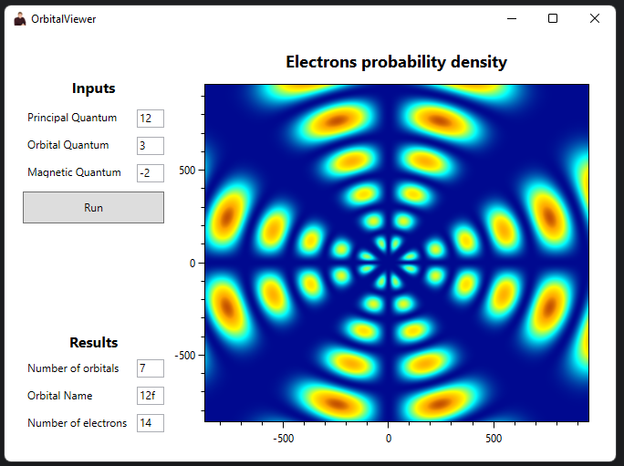

# Summary

A program that graphically models the orbital of a hydrogen-like atom based on the introduced quantum numbers

# Theory

Atomic orbitals modeling via wave function

$$
\begin{aligned}
&\Psi_{n \ell m}(r, \theta, \phi)=R_{\ell}^{n}(r) Y_{\ell}^{m}(\theta, \phi) \\
&R_{\ell}^{n}(r)=\sqrt{\left(\frac{2}{n a_{0}}\right)^{3} \frac{(n-\ell-1) !}{2 n[(n+\ell) !]}} e^{-r / n a_{0}}\left(\frac{2 r}{n a_{0}}\right)^{\ell} L_{n-\ell-1}^{2 \ell+1}\left(\frac{2 r}{n a_{0}}\right) \\
&L_{k+1}^{(\alpha)}(x)=\frac{(2 k+1+\alpha-x) L_{k}^{(\alpha)}(x)-(k+\alpha) L_{k-1}^{(\alpha)}(x)}{k+1} \\
&Y_{\ell}^{m}(\theta, \varphi)=(-1)^{m} \sqrt{\frac{(2 \ell+1)}{4 \pi} \frac{(\ell-m) !}{(\ell+m) !}} P_{\ell}^{m}(\cos \theta) e^{i m \varphi} \\
&P_{l}^{m}(x)=(-1)^{m} \cdot 2^{l} \cdot\left(1-x^{2}\right)^{m / 2} \cdot \sum_{k=m}^{l} \frac{k !}{(k-m) !} \cdot x^{k-m} \cdot\left(\begin{array}{l}
l \\
k
\end{array}\right)\left(\begin{array}{l}
\frac{l+k-1}{2} \\
l
\end{array}\right) \\
&a_{0}=\frac{4 \pi \varepsilon_{0} \hbar^{2}}{m_{\mathrm{e}} e^{2}} \approx 5.2946541 \times 10^{-11} \mathrm{~m}
\end{aligned}

$$

# Usage

Input quantum numbers by rule and press "Run" button

*Be careful with big numbers*

As a result - displayed orbital info