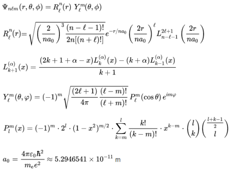

# Summary

A program that graphically models the orbital of a hydrogen-like atom based on the introduced quantum numbers

# Theory

Atomic orbitals modeling via wave function

# Usage

Input quantum numbers by rule and press "Run" button

*Be careful with big numbers*

As a result - displayed orbital info